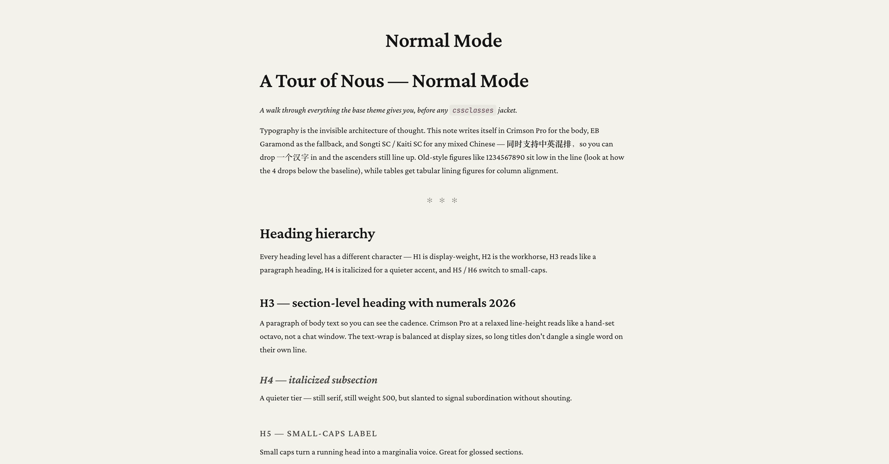
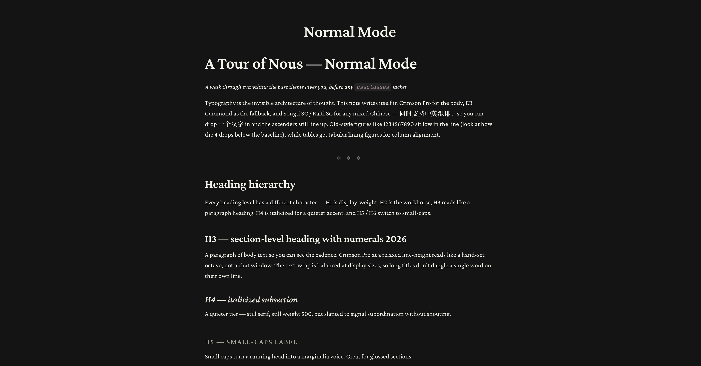
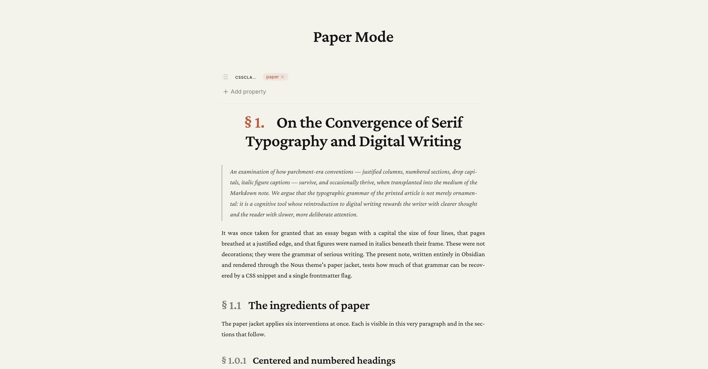
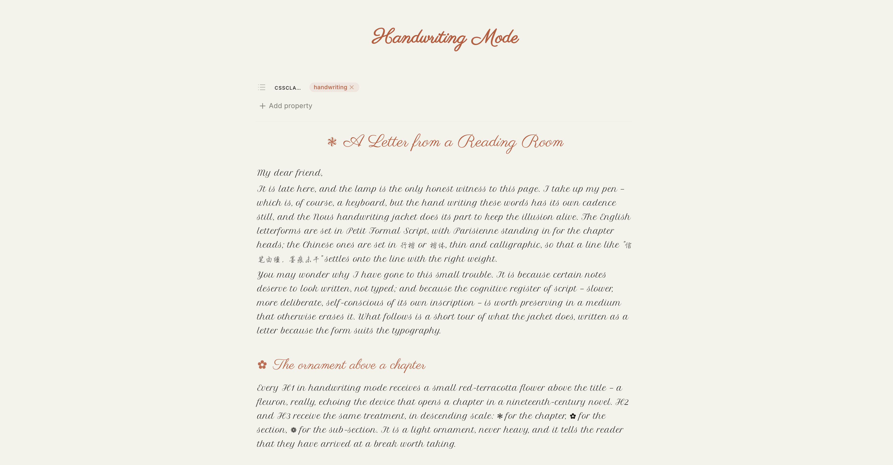
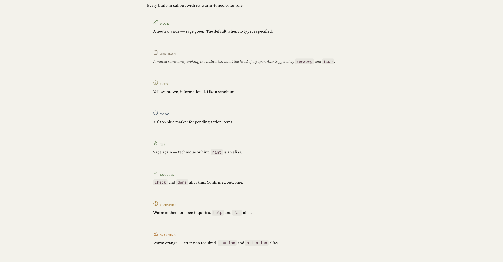
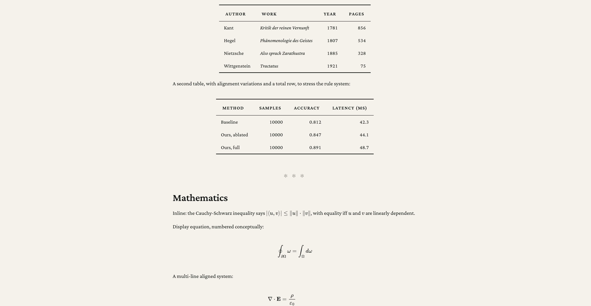

<h1 align="center">Nous — An Obsidian theme</h1>

<p align="center">
  <em>Warm parchment, serif headlines, theorem-style callouts —<br>
  Claude's editorial aesthetic fused with LaTeX academic typography.</em>
</p>

<p align="center">
  <a href="https://github.com/islgl/nous-obsidian-theme/releases"></a>
  <a href="LICENSE"></a>
  
  
</p>

Nous (νοῦς, *mind / intellect*) turns an Obsidian vault into a scholar's notebook: a parchment-toned canvas, a medium-weight serif headline voice, booktabs tables, theorem-like callouts, and per-note "paper" / "handwriting" modes you can flip on with a single frontmatter flag.

---

## Preview

<table>
  <tr>
    <td align="center" width="50%">
      <br>
      <sub><em>Base theme — reading view, light.</em></sub>
    </td>
    <td align="center" width="50%">
      <br>
      <sub><em>Dark mode — same warm discipline, near-black surface.</em></sub>
    </td>
  </tr>
  <tr>
    <td align="center" width="50%">
      <br>
      <sub><em><code>cssclasses: [paper]</code> — numbered §, drop cap, justify.</em></sub>
    </td>
    <td align="center" width="50%">
      <br>
      <sub><em><code>cssclasses: [handwriting]</code> — script body, ❦ fleuron.</em></sub>
    </td>
  </tr>
  <tr>
    <td align="center" width="50%">
      <br>
      <sub><em>Built-in callouts — warm palette, serif labels.</em></sub>
    </td>
    <td align="center" width="50%">
      <br>
      <sub><em>Booktabs tables and display math — LaTeX-style rules.</em></sub>
    </td>
  </tr>
</table>

---

## Install

### Community store (recommended)

1. Obsidian → **Settings → Appearance → Themes → Manage** → search **Nous** → **Install** → **Use**.
2. You'll get automatic updates whenever a new version is released.

> If you don't see Nous yet, the community PR may still be in review — use the manual path below in the meantime.

### Manual

1. Download `theme.css` and `manifest.json` from the [latest release](https://github.com/islgl/nous-obsidian-theme/releases).
2. Put them in `YourVault/.obsidian/themes/Nous/`.
3. Obsidian → **Settings → Appearance → Themes → Nous**.

---

## Features

- **Warm Claude palette** — parchment `#f5f4ed` canvas, terracotta `#c96442` accent, every gray carries a yellow-brown undertone, no cool blue-grays anywhere
- **Serif body in edit *and* reading view** — Crimson Pro / EB Garamond / Songti SC, so you write on paper, not in a chat box
- **LaTeX booktabs tables** — top & bottom 2px rules, 1px mid rule, no verticals, small-caps header row
- **Theorem-style callouts** — 13+ built-in types plus custom `[!theorem]` / `[!lemma]` / `[!proposition]` / `[!corollary]` / `[!proof]` / `[!definition]` / `[!remark]` / `[!example]`; `[!proof]` auto-appends ∎
- **Mermaid in warm palette** — flowchart / sequence / state / class / gantt / pie / ER diagrams all recolored
- **Light & dark, both warm** — near-black `#141413` dark variant keeps the same warm-tone discipline
- **Ring shadows over drop shadows** — depth via inset / 1px rings in warm grays, à la Claude
- **Content typography** — small-caps at H5 / H6, italic at H4, tight display letter-spacing on the inline title, old-style figures in body text with tabular lining figures in tables

---

## Per-note modes

Nous supports optional "jackets" via the `cssclasses` frontmatter. Stack them.

```yaml
---
cssclasses:
  - paper        # LaTeX article mode
  - handwriting  # quill-and-parchment mode
---
```

### Paper mode

- Section-numbered headings (`§ 1.1.1`) with the `§` mark in terracotta
- Drop cap on the first paragraph
- Justified body with automatic hyphenation
- Figure N / Table N italic captions (from `` followed by `*caption*`)
- `<hr>` becomes a single `§` ornament
- H1 centered, with the section number on the same line
- Tighter column width than the global reading width

### Handwriting mode

- English body in Pinyon Script / Parisienne
- Chinese body in Xingkai SC 行楷 / Kaiti SC 楷体 (thin, calligraphic)
- H1 / H2 / H3 get flower ornaments (❃ ✿ ❁) in terracotta
- Code blocks, tables, math blocks **revert to monospace / serif** so they stay legible
- Paragraphs get first-line indent like a hand-copied page
- Blockquotes become centered pull-quotes with a raised open-quote glyph
- Edit mode uses normal body size so typing isn't encumbered; preview goes full calligraphy

Compose `paper` + `handwriting` → a hand-scribed academic article (drop cap in Parisienne, justified script body, numbered sections).

---

## Optional snippets

Drop the contents of `snippets/` (also in the `snippets.zip` release asset) into `YourVault/.obsidian/snippets/` and enable each in **Settings → Appearance → CSS snippets**.

| Snippet | What it does |
| --- | --- |
| `nous-paper-mode.css` | The full paper-mode rule set (trigger: `cssclasses: [paper]`) |
| `nous-handwriting.css` | The full handwriting-mode rule set (trigger: `cssclasses: [handwriting]`) |
| `nous-theorem-counters.css` | Auto-number `theorem` / `lemma` / `proposition` / `corollary` callouts amsthm-style |
| `nous-classical-figures.css` | OpenType old-style figures in body; tabular lining figures in tables |

---

## Style Settings integration

If you have the **Style Settings** community plugin installed, Nous exposes controls for:

- Serif heading / body font
- Sans UI font
- Monospace font
- Body text size
- Body line height
- Reading column width
- Toggle: justified body
- Toggle: numbered headings (`§ 1.1.1` in standard reading view, no `paper` class needed)
- Toggle: drop-cap first paragraph
- Toggle: disable small-caps H5 / H6

---

## Font stack and credits

Nous loads via Google Fonts. If you're offline or prefer different faces, set your own via Style Settings.

- [Crimson Pro](https://fonts.google.com/specimen/Crimson+Pro) — Sebastian Kosch (body + headline serif)
- [EB Garamond](https://fonts.google.com/specimen/EB+Garamond) — Georg Duffner (fallback serif)
- [Inter](https://fonts.google.com/specimen/Inter) — Rasmus Andersson (UI sans)
- [JetBrains Mono](https://fonts.google.com/specimen/JetBrains+Mono) — JetBrains (code)
- [Pinyon Script](https://fonts.google.com/specimen/Pinyon+Script) — Nicole Fally (handwriting body)
- [Parisienne](https://fonts.google.com/specimen/Parisienne) — Astigmatic (handwriting headline)
- [Long Cang](https://fonts.google.com/specimen/Long+Cang) — Chinese calligraphic fallback
- **Songti SC** / **Kaiti SC** / **Xingkai SC** / **Hanzipen SC** — macOS system (Chinese)

---

## Roadmap

`1.0.0` is the first stable release — daily-driver-ready, palette locked, variable names stable. Post-1.0 work will focus on:

- More `cssclasses` jackets (e.g. `[slides]`, `[manuscript]`)
- Fuller coverage of third-party plugin UIs (Kanban, Advanced Tables, Excalidraw, Canvas)
- Accessibility audits and high-contrast variants

File issues with screenshots and the offending element's selector (Cmd+Option+I → Inspect) if you hit something.

---

## Acknowledgments

- **[Claude](https://claude.com) / Anthropic** — the entire visual language is a studied homage to Claude's web-reading interface. Every palette token, the ring-shadow depth system, the quiet serif voice, and the yellow-brown gray ramp are interpretations of that aesthetic. Nous is an independent project and is not affiliated with or endorsed by Anthropic.
- **The LaTeX / booktabs tradition** — the rule system, theorem environments, and §-numbered section conventions are lifted from decades of academic typesetting practice.
- **Obsidian community** — for the `cssclasses` mechanism and Style Settings plugin that make per-note jackets and user-facing controls possible.

---

## License

[MIT](LICENSE) © 2026 [shufflgl](https://github.com/islgl)
